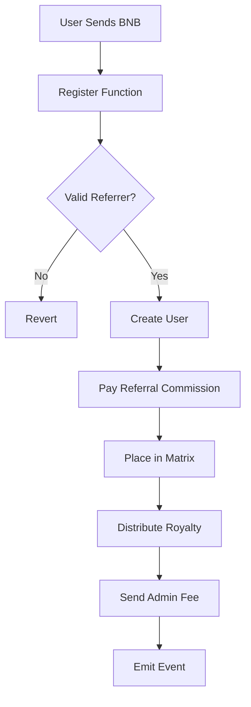
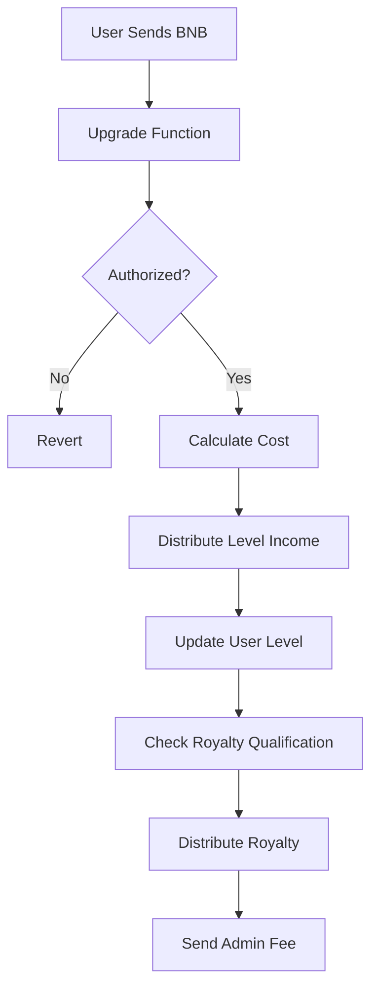

# Universal Matrix - MLM Smart Contract System

A modern, upgradeable multi-level marketing (MLM) smart contract system with binary matrix placement, 13-level progression, and automated royalty distribution.

## 🌟 Features

- **UUPS Upgradeable Architecture** - Future-proof contract design
- **Binary Matrix Placement** - Automatic spillover algorithm with 2 direct positions
- **13-Level System** - Progressive pricing from 4 to 12,288 USDT equivalent in BNB
- **Triple Income Streams**:
  - 💰 **Referral Income** - 100% of level price to direct sponsor
  - 📊 **Level Income** - Distributed to qualified upline members
  - 💎 **Royalty Pools** - 4 tiers for levels 10-13 with daily distribution
- **ROI Cap** - 150% maximum return protection
- **Security Features** - ReentrancyGuard, Pausable, Ownable

## 📋 Table of Contents

- [Architecture](#architecture)
- [Economic Model](#economic-model)
- [Installation](#installation)
- [Deployment](#deployment)
- [Usage](#usage)
- [Testing](#testing)
- [Security](#security)
- [License](#license)

## 🏗️ Architecture

### Smart Contracts

1. **UniversalMatrix.sol** - Main upgradeable contract
   - User registration and management
   - Binary matrix placement algorithm
   - Income distribution logic
   - Royalty pool management

2. **RoyaltyVault.sol** - Separate vault for royalty funds
   - Holds royalty deposits
   - Authorized withdrawal system
   - Emergency recovery functions

### Key Components

```
┌─────────────────────────────────────────┐
│         UniversalMatrix (Proxy)         │
│  - User Registration                    │
│  - Matrix Placement                     │
│  - Income Distribution                  │
│  - Royalty Management                   │
└─────────────┬───────────────────────────┘
              │
              ├──────────────┐
              │              │
    ┌─────────▼────────┐   ┌▼──────────────┐
    │ RoyaltyVault     │   │ Fee Receiver  │
    │ (Royalty Funds)  │   │ (Admin Fees)  │
    └──────────────────┘   └───────────────┘
```

## 💰 Economic Model

### Level Prices (USDT Equivalent in BNB)

| Level | Price (USDT) | Admin Fee (10%) | Total Cost |
|-------|--------------|-----------------|------------|
| 1     | 4            | 0.4             | 4.4        |
| 2     | 6            | 0.6             | 6.6        |
| 3     | 12           | 1.2             | 13.2       |
| 4     | 24           | 2.4             | 26.4       |
| 5     | 48           | 4.8             | 52.8       |
| 6     | 96           | 9.6             | 105.6      |
| 7     | 192          | 19.2            | 211.2      |
| 8     | 384          | 38.4            | 422.4      |
| 9     | 768          | 76.8            | 844.8      |
| 10    | 1,536        | 153.6           | 1,689.6    |
| 11    | 3,072        | 307.2           | 3,379.2    |
| 12    | 6,144        | 614.4           | 6,758.4    |
| 13    | 12,288       | 1,228.8         | 13,516.8   |

### Income Distribution

**Registration/Upgrade Payment Breakdown:**
- 90% → Level Price (distributed as income)
- 10% → Admin Fee (to fee receiver)

**Level Price Distribution:**
- 95% → Referral/Level Income
- 5% → Royalty Pools

**Royalty Pool Distribution (4 Tiers):**
- Tier 1 (Level 10): 40% of royalty funds
- Tier 2 (Level 11): 30% of royalty funds
- Tier 3 (Level 12): 20% of royalty funds
- Tier 4 (Level 13): 10% of royalty funds

### Qualification Requirements

- **Referral Income**: Automatic (direct sponsor receives 100%)
- **Level Income**: Requires 2 direct referrals + higher level than downline
- **Royalty Pools**: Requires reaching levels 10-13 + 2 direct referrals
- **ROI Cap**: Maximum 150% of total deposits

## 🚀 Installation

### Prerequisites

- Node.js v16+ and npm
- Git

### Setup

```bash
# Clone the repository
git clone <your-repo-url>
cd matrix

# Install dependencies
npm install

# Copy environment file
cp .env.example .env

# Edit .env with your configuration
# Add your PRIVATE_KEY and other settings
```

### Environment Variables

```env
PRIVATE_KEY=your_private_key_here
BSC_TESTNET_RPC=https://data-seed-prebsc-1-s1.binance.org:8545
BSC_RPC=https://bsc-dataseed1.binance.org
BSCSCAN_API_KEY=your_bscscan_api_key
```

## 📦 Deployment

### Local Development

```bash
# Start local Hardhat node
npx hardhat node

# In another terminal, deploy
npx hardhat run scripts/deploy.js --network localhost
```

### Testnet Deployment (BSC Testnet)

```bash
# Deploy to BSC Testnet
npx hardhat run scripts/deploy.js --network bscTestnet

# Verify contracts
npx hardhat verify --network bscTestnet <ROYALTY_VAULT_ADDRESS> "<OWNER_ADDRESS>"
npx hardhat verify --network bscTestnet <IMPLEMENTATION_ADDRESS>
```

### Mainnet Deployment

```bash
# Deploy to BSC Mainnet
npx hardhat run scripts/deploy.js --network bsc

# Verify contracts
npx hardhat verify --network bsc <ROYALTY_VAULT_ADDRESS> "<OWNER_ADDRESS>"
npx hardhat verify --network bsc <IMPLEMENTATION_ADDRESS>
```

## 💻 Usage

### Register a New User

```javascript
const { ethers } = require("hardhat");

const matrix = await ethers.getContractAt("UniversalMatrix", PROXY_ADDRESS);
const defaultRefer = await matrix.defaultRefer();
const [prices, fees] = await matrix.getLevels();
const cost = prices[0] + (prices[0] * fees[0] / 100n);

await matrix.register(defaultRefer, userAddress, { value: cost });
```

### Upgrade User Level

```javascript
const userId = await matrix.id(userAddress);
const levelsToUpgrade = 1;

// Calculate cost
let totalCost = 0n;
const user = await matrix.userInfo(userId);
for (let i = Number(user.level); i < Number(user.level) + levelsToUpgrade; i++) {
  totalCost += prices[i] + (prices[i] * fees[i] / 100n);
}

await matrix.upgrade(userId, levelsToUpgrade, { value: totalCost });
```

### Claim Royalty

```javascript
const royaltyTier = 0; // 0-3 for levels 10-13
await matrix.claimRoyalty(royaltyTier);
```

### View User Information

```javascript
const userId = await matrix.id(userAddress);
const userInfo = await matrix.userInfo(userId);

console.log("Level:", userInfo.level.toString());
console.log("Total Income:", ethers.formatEther(userInfo.totalIncome), "BNB");
console.log("Direct Team:", userInfo.directTeam.toString());
```

### Using Interaction Script

```bash
# Edit scripts/interact.js and uncomment the function you want to use
# Then run:
npx hardhat run scripts/interact.js --network <network-name>
```

## 🧪 Testing

### Run All Tests

```bash
npx hardhat test
```

### Run Specific Test

```bash
npx hardhat test --grep "Registration"
```

### Coverage Report

```bash
npx hardhat coverage
```

### Gas Report

```bash
REPORT_GAS=true npx hardhat test
```

## 🔒 Security

### Implemented Security Measures

1. **ReentrancyGuard** - Prevents reentrancy attacks
2. **Ownable** - Access control for admin functions
3. **Pausable** - Emergency pause mechanism
4. **UUPS Upgradeable** - Controlled upgrade authorization
5. **ROI Cap** - 150% maximum return limit
6. **Input Validation** - Comprehensive checks on all inputs

### Security Considerations

- ⚠️ **Price Oracle**: Level prices are hardcoded. Consider adding a price oracle for dynamic BNB/USDT conversion
- ⚠️ **Upgrade Mechanism**: Only owner can upgrade. Implement multi-sig for production
- ⚠️ **Emergency Functions**: `emergencyWithdraw` should be protected with timelock
- ⚠️ **Royalty Distribution**: Manual trigger required via `movePendingRoyaltyUsers`

### Audit Recommendations

Before mainnet deployment:
1. Professional smart contract audit
2. Implement multi-signature wallet for owner
3. Add timelock for critical functions
4. Consider adding circuit breakers
5. Implement comprehensive monitoring

## 📊 Contract Interaction Flow

### Registration Flow



### Upgrade Flow



## 🛠️ Admin Functions

### Pause Contract

```javascript
await matrix.setPaused(true);  // Pause
await matrix.setPaused(false); // Unpause
```

### Update Fee Receiver

```javascript
await matrix.setFeeReceiver(newReceiverAddress);
```

### Update Royalty Vault

```javascript
await matrix.setRoyaltyVault(newVaultAddress);
```

### Update Level Prices

```javascript
const newPrices = [/* 13 new prices */];
await matrix.updateLevelPrices(newPrices);
```

### Emergency Withdrawal

```javascript
await matrix.emergencyWithdraw();
```

## 📈 Monitoring & Analytics

### Key Metrics to Track

- Total users registered
- Total BNB deposited
- Active users per level
- Royalty pool balances
- Daily registration/upgrade volume
- Income distribution statistics

### Events to Monitor

- `Registered` - New user registration
- `Upgraded` - User level upgrade
- `RoyaltyClaimed` - Royalty claim
- `MatrixPlaced` - Matrix placement
- `Paused` - Contract pause state change

## 🔄 Upgrading the Contract

```javascript
const UniversalMatrixV2 = await ethers.getContractFactory("UniversalMatrixV2");
const upgraded = await upgrades.upgradeProxy(PROXY_ADDRESS, UniversalMatrixV2);
console.log("Upgraded to:", await upgraded.getAddress());
```

## 📝 License

MIT License - see LICENSE file for details

## 🤝 Contributing

Contributions are welcome! Please:
1. Fork the repository
2. Create a feature branch
3. Commit your changes
4. Push to the branch
5. Open a Pull Request

## ⚠️ Disclaimer

This smart contract system is provided as-is. Users should:
- Conduct thorough testing before mainnet deployment
- Obtain professional security audits
- Understand local regulations regarding MLM systems
- Implement proper risk management

## 📞 Support

For issues and questions:
- Open an issue on GitHub
- Review existing documentation
- Check test files for usage examples

---

**Built with ❤️ using Hardhat and OpenZeppelin**
